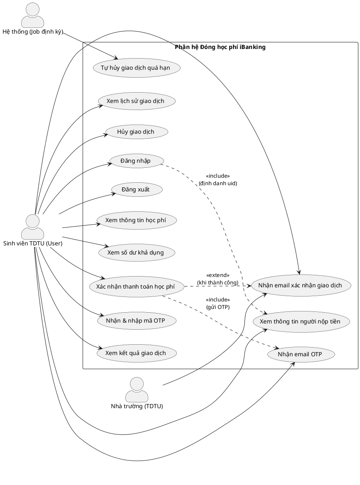
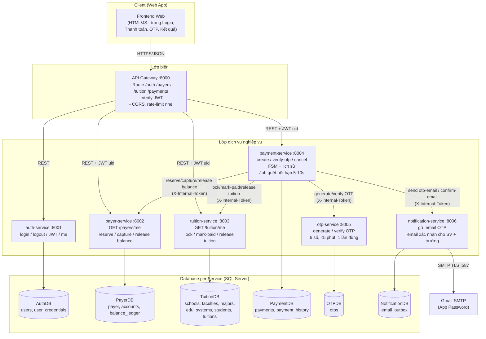
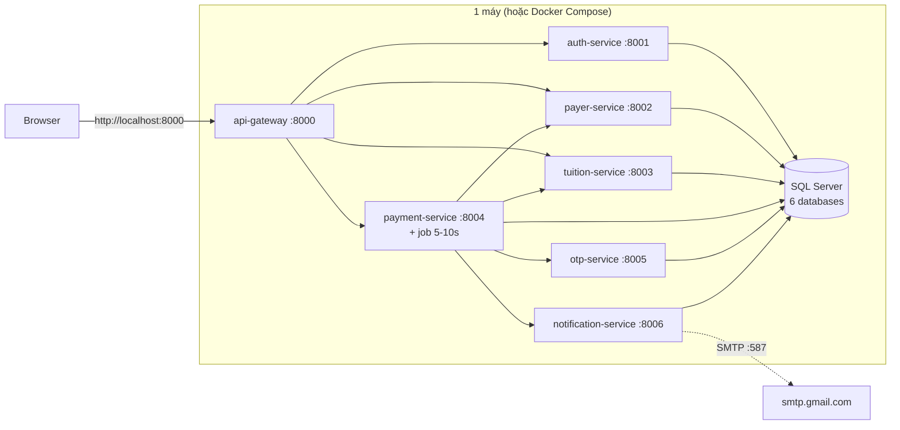

# Tài liệu 02 — Kiến trúc Microservices

> Đáp ứng yêu cầu đề bài mục 1 (Use Case Diagram) và mục 2 (Microservices Architecture Diagram + trách nhiệm service + cách giao tiếp).

## 1. Use Case Diagram

### 1.1 Sơ đồ (PlantUML — dán vào https://www.plantuml.com/plantuml hoặc plugin PlantUML trên VS Code để render)

### 1.2 Đặc tả vắn tắt từng use case

| UC | Tên | Actor | Mô tả | Kết quả |
|---|---|---|---|---|
| UC1 | Đăng nhập | User | Nhập username (MSSV) + password | JWT |
| UC2 | Đăng xuất | User | Hủy phiên | Token bị xóa phía client |
| UC3 | Xem thông tin người nộp | User | `GET /payers/me` | Họ tên, SĐT, email (read-only) |
| UC4 | Xem thông tin học phí | User | `GET /tuition/me` | MSSV, họ tên SV, số tiền còn nợ |
| UC5 | Xem số dư | User | Một phần UC3 | Available balance |
| UC6 | Xác nhận thanh toán | User | Tạo payment + gửi OTP | Payment PENDING/OTP_SENT |
| UC7 | Nhập OTP | User | Xác thực OTP, xử lý trừ tiền | Payment SUCCESS/FAILED |
| UC8 | Xem kết quả | User | Nhận receipt | Mã giao dịch, số tiền, thời gian |
| UC9 | Xem lịch sử | User | `GET /payments` | Danh sách giao dịch |
| UC10 | Hủy giao dịch | User | Hủy payment đang chờ | Payment CANCELLED |
| UC11–12 | Nhận email | User / Nhà trường | Email OTP / xác nhận | Email đến hộp thư |
| UC13 | Tự hủy quá hạn | Job 5–10s | Quét payment hết hạn | Payment EXPIRED/CANCELLED |

## 2. Nguyên tắc kiến trúc

1. **Database per Service** — mỗi service sở hữu 1 database riêng; không service nào đọc/ghi thẳng DB của service khác.
2. **Giao tiếp chỉ qua REST API** giữa các service (đồng bộ, có timeout + retry có kiểm soát). Event/queue chỉ dùng nếu cần bất đồng bộ — ở phạm vi đồ án: không bắt buộc.
3. **API Gateway** là điểm vào **duy nhất** của client; service nội bộ không expose ra ngoài.
4. **Stateless** — mọi định danh nằm trong JWT; service không giữ session.
5. **Payment Service là orchestrator** — điều phối payer/tuition/otp/notification, sở hữu FSM giao dịch.
6. **Bảo mật 2 lớp** — JWT cho người dùng cuối; `X-Internal-Token` cho gọi nội bộ giữa các service.

## 3. Microservices Architecture Diagram

> **Ghi chú triển khai:** để đồ án gọn, các service chạy cùng 1 SQL Server instance, mỗi service có database riêng (schema database riêng biệt). Về nguyên tắc vẫn là Database-per-Service.

## 4. Trách nhiệm chi tiết từng service

### 4.1 auth-service (`:8001`)
| Hạng mục | Chi tiết |
|---|---|
| Endpoints ngoài | `POST /auth/login`, `POST /auth/logout`, `GET /auth/me` |
| Endpoints nội bộ | `POST /internal/verify-jwt` (gateway gọi khi xác thực request) |
| Nghiệp vụ | Kiểm tra username theo chuẩn MSSV TDTU; bcrypt verify password; cấp JWT HS256 (claims: `uid`, `username`, `role`, `exp` 30 phút); trả profile |
| Database | `AuthDB` |
| Ràng buộc | Password hash ở bảng `user_credentials` riêng, JOIN bằng `uid` |

### 4.2 payer-service (`:8002`)
| Hạng mục | Chi tiết |
|---|---|
| Endpoints ngoài | `GET /payers/me` |
| Endpoints nội bộ | `POST /internal/balance/reserve`, `POST /internal/balance/capture`, `POST /internal/balance/release` (nhận `payment_id`, `uid`, `amount`) |
| Nghiệp vụ | Chỉ trả thông tin payer tương ứng `uid` trong JWT; số dư set cứng từ seed; trừ tiền nguyên tử với row lock; ghi `balance_ledger` (reference `payment_id`) |
| Database | `PayerDB` |
| Ràng buộc | `CHECK (available_balance >= 0)`; capture = `UPDATE ... WHERE uid=@uid AND available_balance>=@amount` bọc trong transaction; idempotent theo `payment_id` |

### 4.3 tuition-service (`:8003`)
| Hạng mục | Chi tiết |
|---|---|
| Endpoints ngoài | `GET /tuition/me` |
| Endpoints nội bộ | `POST /internal/tuition/lock`, `POST /internal/tuition/paid`, `POST /internal/tuition/release` (nhận `payment_id`) |
| Nghiệp vụ | Từ `uid` → `student_id` → các tuitions `UNPAID` của chính sinh viên; chuyển trạng thái `UNPAID → PAYING → PAID`; đảm bảo 1 khoản chỉ PAID 1 lần |
| Quản lý | `schools` (trường), `faculties` (khoa), `majors` (ngành), `edu_systems` (hệ + mã hệ), `students` (bảng nhận diện MSSV), `tuitions` |
| Database | `TuitionDB` |
| Ràng buộc | Lock là `UPDATE tuitions SET status='PAYING' WHERE tuition_id=@id AND status='UNPAID'` — ai update 0 dòng là thua (case B concurrency); `CHECK status IN (...)` |

### 4.4 payment-service (`:8004`) — Orchestrator
| Hạng mục | Chi tiết |
|---|---|
| Endpoints ngoài | `POST /payments`, `GET /payments/{id}`, `GET /payments`, `POST /payments/{id}/verify-otp`, `POST /payments/{id}/cancel`, `POST /payments/{id}/resend-otp` |
| Nghiệp vụ | Sở hữu FSM: `PENDING → OTP_SENT → PROCESSING → SUCCESS/FAILED/CANCELLED/EXPIRED`; điều phối gọi payer/tuition/otp/notification theo đúng thứ tự; lưu history + snapshot từng bước; **job nền quét 5–10s** tự hủy giao dịch quá hạn |
| Database | `PaymentDB` |
| Ràng buộc | Đúng 1 payment active cho 1 (`uid`, `tuition_id`); idempotency; correlation id = `payment_id` đi kèm mọi call nội bộ |

### 4.5 otp-service (`:8005`)
| Hạng mục | Chi tiết |
|---|---|
| Endpoints nội bộ | `POST /internal/otp/generate` (nhận `uid`, `payment_id`, `email`), `POST /internal/otp/verify` (nhận `payment_id`, `code`) |
| Nghiệp vụ | Sinh OTP **6 chữ số** (dùng `secrets.randbelow`), expiry < 5 phút; verify: so code, kiểm tra hạn, giới hạn 5 lần sai; cập nhật `status` thành `EXPIRED`/`USED`/`LOCKED`/`REPLACED`, chỉ tác vụ dọn dữ liệu mới xóa bản ghi |
| Database | `OTPDB` |
| Ràng buộc | `UNIQUE (uid) WHERE status='ACTIVE'` và `UNIQUE (payment_id) WHERE status='ACTIVE'` → 1 OTP hiệu lực cho 1 tài khoản/1 giao dịch; code không trùng OTP ACTIVE khác; `CHECK (expires_at > created_at)` |

### 4.6 notification-service (`:8006`)
| Hạng mục | Chi tiết |
|---|---|
| Endpoints nội bộ | `POST /internal/notifications/otp-email`, `POST /internal/notifications/confirm-email` |
| Nghiệp vụ | Gửi email OTP cho người nộp; gửi email xác nhận cho **người nộp + nhà trường**; ghi `email_outbox` (retry nếu thất bại); template email tùy chỉnh |
| Database | `NotificationDB` |
| Ngoại kết nối | Gmail SMTP `smtp.gmail.com:587` (STARTTLS, App Password) |

### 4.7 api-gateway (`:8000`)
| Hạng mục | Chi tiết |
|---|---|
| Chức năng | Điểm vào duy nhất; kiểm tra JWT (gọi `auth-service`); chuyển tiếp request; CORS; log `payment_id`; cân bằng tạm thời bằng route tĩnh |
| Không làm | Không nắm business logic, không cache nghiệp vụ |

## 5. Cách thức giao tiếp giữa các service

### 5.1 Ma trận giao tiếp

| Từ \ Đến | auth | payer | tuition | payment | otp | notification |
|---|:--:|:--:|:--:|:--:|:--:|:--:|
| api-gateway | ✓ | ✓ | ✓ | ✓ | – | – |
| payment-service | – | ✓ | ✓ | – | ✓ | ✓ |
| Các service khác | – | – | – | – | – | – |

- Mũi tên nghiệp vụ đều **xuất phát từ payment-service** (orchestrator) — triệt tiêu vòng gọi chéo không kiểm soát.
- Mọi call nội bộ: header `X-Internal-Token` + `X-Correlation-Id: {payment_id}` + timeout 5s + retry tối đa 2 lần (chỉ retry cho idempotent call).

### 5.2 Quy ước giao tiếp đồng bộ (REST)

| Quy ước | Giá trị |
|---|---|
| Serialization | JSON, UTF-8 |
| Version | Tiền tố `/v1` nội bộ; đường ngoài giữ đúng đề (`/auth/login`, `/payers/me`, …) |
| Lỗi | Body chuẩn `{"error": {"code": "...", "message": "..."}}`, map đúng HTTP status |
| Timeout | 5 giây; 408/504 nếu quá hạn |
| Idempotency | Key theo `payment_id` cho balance capture, tuition state change, generate OTP |

### 5.3 Vì sao không dùng distributed transaction giữa các service

- Distributed transaction (2PC) quá nặng và chậm cho đồ án; thay vào đó dùng **Saga choreography đơn giản hóa** (orchestrator + bù trừ — compensating action):
  - Thành công: reserve balance → lock tuition → OTP → capture balance → tuition PAID → payment SUCCESS.
  - Thất bại ở bước nào: release/lỗi bù trừ các bước trước → payment FAILED → (tuỳ chọn) email thất bại.
- Tính nhất quán cuối cùng được đảm bảo bằng **job quét** đối chiếu payment với tuitions/accounts định kỳ.

## 6. Sơ đồ triển khai (deployment)

## 7. Ranh giới dữ liệu & định danh xuyên service

| Thực thể | Chủ sở hữu | Dùng ở service khác dưới dạng |
|---|---|---|
| `uid` (user) | auth-service | **Reference id** trong JWT (không tạo FK xuyên DB) |
| `student_id`, `tuition_id` | tuition-service | Reference id trong payment; payment luôn hỏi tuition-service để validate |
| `payment_id` | payment-service | Reference id trong PayerDB, OTPDB, NotificationDB |
| Email người nộp | payer-service | payment-service lấy qua `GET /payers/me` (nội bộ) rồi truyền cho otp/notification |

**Nguyên tắc:** reference bằng id + kiểm tra chéo qua API tại thời điểm xử lý — không bao giờ JOIN trực tiếp xuyên database.