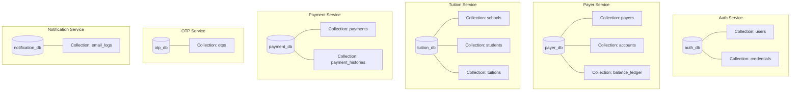

# Tài liệu 04 — Thiết kế Cơ sở dữ liệu (MongoDB - Database per Service & CQRS)

> Đáp ứng yêu cầu chuẩn hóa kiến trúc Microservices: Mỗi service có 1 Database MongoDB độc lập (**Database-per-Service**). Áp dụng **Selective CQRS (Read/Write Model Separation)** cho các dữ liệu quan trọng/nhạy cảm.

---

## 1. Sơ đồ Ranh giới Cơ sở dữ liệu (Database per Service)



---

## 2. Thiết Kế Chi Tiết 6 MongoDB Databases

### 2.1 `auth_db` (Auth Service)
* **Collection `users`** (Read/Write Model):
  - `uid` (int, Unique Index): ID định danh người dùng.
  - `username` (string, Unique Index): MSSV chuẩn TDTU (vd: `521H0092`, `523H0058`).
  - `full_name`, `phone`, `email`, `role` (`student`/`admin`), `status` (`ACTIVE`/`LOCKED`), `created_at`.
* **Collection `credentials`** (Write Model):
  - `uid` (int, Unique Index): Tham chiếu `users.uid`.
  - `password_hash` (string): bcrypt hash. Tuyệt đối không xuất ra API đọc.

### 2.2 `payer_db` (Payer Service)
* **Collection `payers`**:
  - `payer_uid` (int, Unique Index), `full_name`, `phone`, `email`.
* **Collection `accounts`** (Write Model):
  - `account_id` (string), `payer_uid` (int, Unique Index), `available_balance` (float), `currency` (`VND`).
* **Collection `balance_ledger`** (Write Model - Audit log):
  - `account_id`, `payment_id`, `change_type` (`CAPTURE`/`RELEASE`), `amount`, `balance_after`, `created_at`.

### 2.3 `tuition_db` (Tuition Service)
* **Collection `schools`**:
  - `school_id` (`TDTU`), `name`, `finance_email`, `beneficiary_name`, `bank_name`, `bank_account_no`.
* **Collection `tuitions`** (Embedded Document - Read & Write Model):
  - `tuition_id` (string, Unique Index): ví dụ `TUI_521H0092_20241`.
  - `student_id` (string): MSSV.
  - `student_name`, `school_id`, `school_name`, `finance_email`, `beneficiary_name`, `bank_name`, `bank_account_no`.
  - `academic_year`, `semester`, `total_amount` (float), `status` (`UNPAID`/`PAYING`/`PAID`).
  - `items`: Danh sách môn học `[{subject_code, subject_name, credits, amount}]`.

### 2.4 `payment_db` (Payment Service)
* **Collection `payments`** (Write Model - FSM State):
  - `payment_id` (string, Unique Index), `uid`, `student_id`, `tuition_id`, `amount`, `status` (`PENDING`/`OTP_SENT`/`PROCESSING`/`SUCCESS`/`FAILED`/`CANCELLED`/`EXPIRED`), `idempotency_key`, `expires_at`, `created_at`, `completed_at`.
* **Collection `payment_histories`** (Read Model - History):
  - `payment_id`, `from_status`, `to_status`, `note`, `created_at`.

### 2.5 `otp_db` (OTP Service)
* **Collection `otps`** (Write Model):
  - `otp_id` (string, Unique Index), `payment_id`, `uid`, `otp_code` (6 chữ số), `status` (`PENDING`/`VERIFIED`/`EXPIRED`/`LOCKED`/`REPLACED`), `attempts`, `expires_at`.

### 2.6 `notification_db` (Notification Service)
* **Collection `email_logs`**:
  - `payment_id`, `to_email`, `recipient_type` (`PAYER`/`SCHOOL`), `template` (`OTP_EMAIL`/`CONFIRM_EMAIL`), `subject`, `status` (`SENT`/`FAILED`), `sent_at`.

---

## 3. Thiết Kế Selective CQRS (Read/Write Model Separation)

Hệ thống áp dụng mô hình phân tách Pydantic models trong `services/shared/models/`:

1. **Auth Service**:
   - `UserPublicProfileReadModel`: Model đọc công khai (không lộ `password_hash`).
   - `UserCredentialWriteModel`: Model ghi quản lý thông tin bảo mật.
2. **Payer Service**:
   - `PayerProfileReadModel`: Model đọc cho `GET /payers/me`.
   - `AccountBalanceWriteModel` & `BalanceLedgerWriteModel`: Model ghi quản lý trừ/hoàn tiền.
3. **Tuition Service**:
   - `TuitionBillReadModel`: Model đọc phiếu học phí tổng hợp.
   - `TuitionStatusWriteModel`: Model ghi chuyển đổi trạng thái đóng học phí.
4. **Payment Service**:
   - `PaymentReceiptReadModel`: Biên lai đọc dữ liệu đã denormalized.
   - `PaymentStateWriteModel`: Quản lý FSM trạng thái giao dịch.
5. **OTP Service**:
   - `OTPVerifyStatusReadModel`: Trả về kết quả verify cho client.
   - `OTPStoreWriteModel`: Bảo mật thông tin mã OTP trong DB.

---

## 4. Hướng Dẫn Tự Động Nạp Dữ Liệu Mẫu (Auto Seed)

Khởi chạy bằng Docker Compose hoặc script Python:
```bash
# Docker Compose tự động nạp dữ liệu khi dựng container:
docker compose up -d

# Hoặc nạp trực tiếp qua Python script:
python scripts/init_mongodb.py
```
Dữ liệu sẽ tự động tạo sẵn 2 sinh viên thử nghiệm:
- `521H0092` - **Võ Thị Thiên Kim** (15,000,000 VND / Học phí: 8,450,000 VND)
- `523H0058` - **Phạm Huỳnh Trịnh Nam** (20,000,000 VND / Học phí: 6,200,000 VND)
- Mật khẩu mặc định: `Password123@`