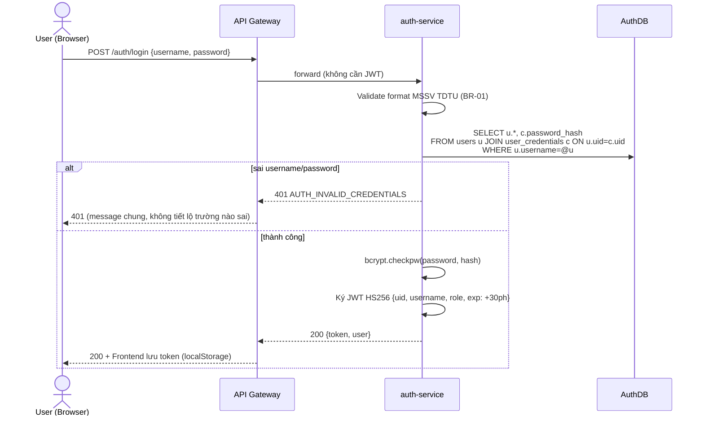
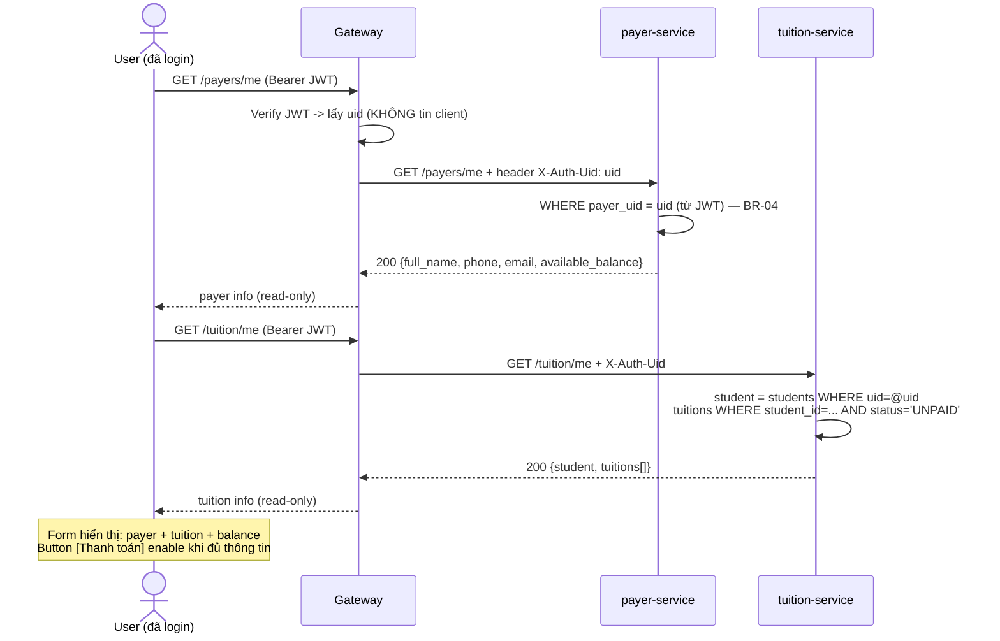
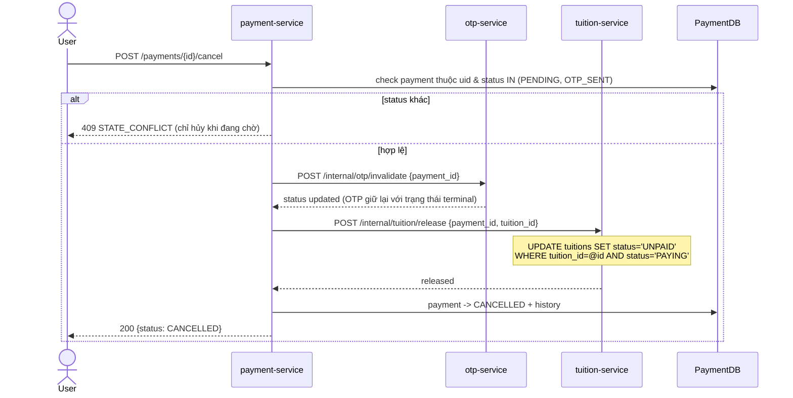
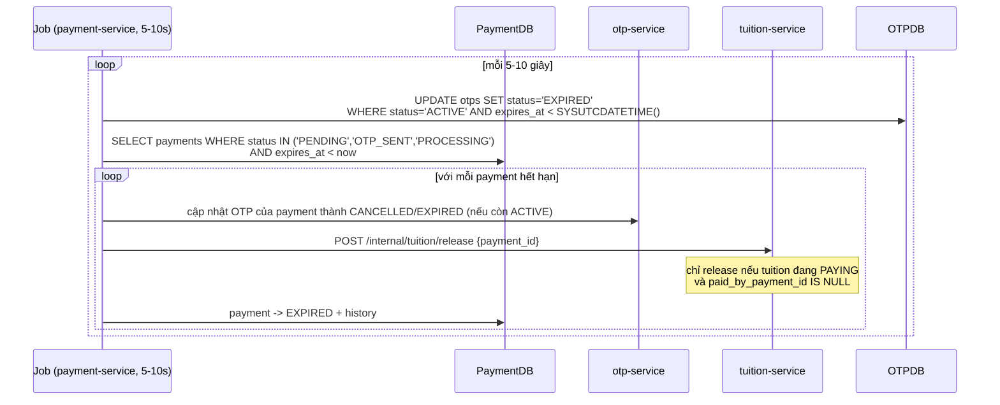

# Tài liệu 05 — Flow nghiệp vụ & Tương tác giữa các Services

> Sequence diagram cho **từng chức năng**, chỉ rõ ai gọi ai, gọi lúc nào, và cách xử lý lỗi/bù trừ. Ký hiệu: nét đứt = response trả về; `alt` = nhánh; `note over` = ghi chú ràng buộc.

## 1. Flow đăng nhập (Login)



**Ràng buộc liên quan:** BR-01, BR-02, BR-03, NFR-03.

## 2. Flow tải màn hình thanh toán



**Ràng buộc liên quan:** BR-04 — client không bao giờ truyền `uid`/`student_id`/`MSSV`.

## 3. Flow tạo giao dịch + gửi OTP (happy path)

```mermaid
sequenceDiagram
    actor U as User
    participant GW as Gateway
    participant PM as payment-service
    participant PD as PaymentDB
    participant P as payer-service
    participant T as tuition-service
    participant O as otp-service
    participant N as notification-service
    participant SMTP as Gmail SMTP

    U->>GW: POST /payments {tuition_id} (+ Idempotency-Key)
    GW->>PM: forward (uid từ JWT)
    PM->>P: GET /internal/payers/{uid}
    P-->>PM: {email, available_balance}
    PM->>T: GET /internal/tuitions/{tuition_id}
    T-->>PM: {student_id, amount, status}

    alt tuition != UNPAID hoặc không thuộc uid
        PM-->>GW: 409 TUITION_ALREADY_PAID / 404 NOT_FOUND
    else tuition hợp lệ
        PM->>PD: INSERT payments (status=PENDING, expires_at=now+5ph)<br/>unique index ux_payments_active chặn payment thứ 2
        Note over PD: DROP nếu vi phạm ux_payments_active -> 409 PAYMENT_ALREADY_ACTIVE
        PM->>T: POST /internal/tuition/lock {payment_id, tuition_id}
        Note over T: UPDATE tuitions SET status='PAYING'<br/>WHERE tuition_id=@id AND status='UNPAID'
        alt lock thất bại (rowcount=0)
            T-->>PM: 409 CONFLICT
            PM->>PD: payment -> CANCELLED (ghi history)
            PM-->>GW: 409 PAYMENT_CONFLICT_CONCURRENT
        else lock thành công
            PM->>O: POST /internal/otp/generate {payment_id, email}
            Note over O: Chuyển OTP ACTIVE cũ sang REPLACED;<br/>sinh code 6 số không trùng OTP ACTIVE khác;<br/>expires_at = now + 5 phút
            O-->>PM: {code, expires_at}
            PM->>N: POST /internal/notifications/otp-email {to_email, code}
            N->>SMTP: gửi email OTP (STARTTLS)
            alt gửi mail thất bại
                N-->>PM: 502
                    PM->>T: release tuition (PAYING->UNPAID) [bù trừ]
                PM->>PD: payment -> FAILED
                PM-->>GW: 503 SERVICE_UNAVAILABLE
            else gửi mail OK
                PM->>PD: payment: PENDING -> OTP_SENT (history)
                PM-->>GW: 201 {payment_id, status: OTP_SENT}
                GW-->>U: hiển thị form nhập OTP
            end
        end
    end
```

**Ràng buộc liên quan:** BR-06, BR-07, BR-08, BR-12, BR-13; luôn `X-Correlation-Id = payment_id` khi gọi nội bộ.

## 4. Flow xác thực OTP & xử lý thanh toán (happy path)

```mermaid
sequenceDiagram
    actor U as User
    participant GW as Gateway
    participant PM as payment-service
    participant PD as PaymentDB
    participant O as otp-service
    participant P as payer-service
    participant T as tuition-service
    participant N as notification-service
    participant SMTP as Gmail SMTP

    U->>GW: POST /payments/{id}/verify-otp {otp}
    GW->>PM: forward (uid từ JWT)
    PM->>PD: SELECT payment WHERE payment_id=@id AND uid=@uid
    Note over PM: 403 nếu payment không thuộc uid;<br/>409 STATE_CONFLICT nếu status != OTP_SENT
    PM->>O: POST /internal/otp/verify {payment_id, code}
    alt OTP sai / hết hạn / đã dùng
        Note over O: sai: attempts+1; >=5 lần sai -> status=LOCKED<br/>hết hạn -> status=EXPIRED
        O-->>PM: 400 OTP_INVALID / OTP_EXPIRED / OTP_USED / OTP_LOCKED
        PM-->>GW: 400 tương ứng (payment vẫn OTP_SENT nếu chưa LOCKED)
    else OTP hợp lệ & còn hạn
        O->>O: verify OK -> UPDATE otps SET status='USED' WHERE otp_id=@id
        O-->>PM: verified=true
        PM->>PD: payment: OTP_SENT -> PROCESSING
        PM->>P: POST /internal/balance/capture {payment_id, uid, amount}
        Note over P: BEGIN TRAN; UPDATE accounts SET balance=balance-@amt<br/>WHERE payer_uid=@uid AND balance>=@amt;<br/>ROWCOUNT=0 -> ROLLBACK + 422
        alt không đủ dư tại thời điểm capture
            P-->>PM: 422 INSUFFICIENT
            PM->>T: release tuition (bù trừ)
            PM->>PD: payment -> FAILED (reason=INSUFFICIENT_BALANCE)
            PM-->>GW: 422 INSUFFICIENT_BALANCE
        else capture thành công
            P-->>PM: {balance_after}
            PM->>T: POST /internal/tuition/paid {payment_id}
            Note over T: UPDATE tuitions SET status='PAID', paid_by_payment_id=@pid<br/>WHERE tuition_id=@id AND status='PAYING'
            T-->>PM: paid=true
            PM->>PD: payment: PROCESSING -> SUCCESS (rowcount kiểm tra ux_payments_success)
            PM->>PD: INSERT payment_history (SUCCESS)
            PM->>N: POST /internal/notifications/confirm-email<br/>{payer_email, school_email, amount,...}  [background]
            N->>SMTP: 1) email SV  2) email nhà trường
            N-->>PM: accepted (không chặn payment nếu lỗi)
            PM-->>GW: 200 SUCCESS receipt
            GW-->>U: Trang kết quả: mã GD, số tiền, thời gian
        end
    end
```

**Ràng buộc liên quan:** BR-08 (OTP 1 lần), BR-10 (không âm dư), BR-11 (tuition PAID 1 lần), BR-14 (email SV + trường), BR-15.

## 5. Flow hủy giao dịch (user chủ động)



## 6. Flow job quét tự hủy giao dịch quá hạn (5–10s/lần)



**Ràng buộc liên quan:** BR-13 — OTP hết hạn chỉ làm mã cũ không dùng được; khi payment hết hạn,
học phí về `UNPAID` để có thể tạo giao dịch mới.

## 7. Case A — 2 giao dịch đồng thời trên cùng 1 tài khoản (chống dư âm)

Dữ liệu demo: balance = 1.000.000đ. GD X = 700.000đ, GD Y = 500.000đ (từ 2 khoản học phí khác học kỳ hoặc 2 request retry).

```mermaid
sequenceDiagram
    participant UX as User (GD X: 700k)
    participant UY as User (GD Y: 500k)
    participant P as payer-service
    participant ACC as accounts (SQL Server)

    par song song
        UX->>P: capture {pid_x, uid, 700000}
        UY->>P: capture {pid_y, uid, 500000}
    end
    P->>ACC: BEGIN TRAN; UPDATE accounts SET balance=balance-700000<br/>WHERE payer_uid=@uid AND balance>=700000
    Note over ACC: X giữ row lock (UPDLOCK) -> balance=300000
    P->>ACC: BEGIN TRAN; UPDATE accounts SET balance=balance-500000<br/>WHERE payer_uid=@uid AND balance>=500000
    Note over ACC: Y chờ lock của X
    ACC-->>P: X: ROWCOUNT=1 -> COMMIT (ledger X)
    ACC-->>P: Y: ROWCOUNT=0 -> ROLLBACK -> 422 INSUFFICIENT_BALANCE
    P-->>UX: SUCCESS (balance_after=300000)
    P-->>UY: 422 -> payment Y FAILED + release tuition Y
```

Kết quả cuối: chỉ X thành công; số dư = 300.000 ≥ 0; lịch sử có đúng 1 CAPTURE 700k. **Ràng buộc:** BR-10 + `uq_ledger_idem`.

## 8. Case B — 2 tài khoản thanh toán cùng 1 khoản học phí (chống double-pay)

*(Dù hệ thống self-payment hạn chế user chỉ trả cho chính mình, case này vẫn được phòng thủ 3 tầng để đáp ứng đề bài.)*

```mermaid
sequenceDiagram
    participant A as Payment A (từ account A)
    participant B as Payment B (từ account B)
    participant T as tuition-service
    participant TU as tuitions (SQL Server)
    participant PD as PaymentDB

    Note over A,B: Cùng tuition_id=10, amount=7.000.000
    par song song
        A->>T: lock {pid_a, tuition_id=10}
        T->>TU: UPDATE tuitions SET status='PAYING'<br/>WHERE tuition_id=10 AND status='UNPAID'
        Note over TU: A thắng: ROWCOUNT=1 (giữ lock tới khi commit)
        B->>T: lock {pid_b, tuition_id=10}
        T->>TU: UPDATE tuitions SET status='PAYING'<br/>WHERE tuition_id=10 AND status='UNPAID'
        Note over TU: B chờ lock; khi A commit, status='PAYING'<br/>-> điều kiện không khớp -> ROWCOUNT=0
    end
    TU-->>T: A: locked=true
    TU-->>T: B: ROWCOUNT=0 -> 409 CONFLICT
    T-->>A: 200 -> A tiếp tục OTP/capture/paid
    T-->>B: 409 -> Payment B CANCELLED
    Note over PD: Tầng chót: ux_payments_success (tuition_id WHERE SUCCESS)<br/>bảo đảm DB không bao giờ có 2 dòng SUCCESS cùng tuition
```

Kết quả: tuition=10 chỉ PAID 1 lần; payment B nhận `PAYMENT_CONFLICT_CONCURRENT`. **Ràng buộc:** BR-11.

## 9. Tổng hợp các luồng bù trừ (compensation map)

| Bước thất bại | Đã làm gì trước đó | Bù trừ | Trạng thái cuối payment |
|---|---|---|---|
| Gửi OTP email lỗi | payment PENDING, tuition PAYING | release tuition, OTP=CANCELLED | FAILED |
| Verify OTP sai/hết hạn | payment OTP_SENT | (sai: attempts+1, vẫn ACTIVE; hết hạn: EXPIRED) | giữ OTP_SENT / EXPIRED |
| Verify OTP khóa (5 lần sai) | payment OTP_SENT, tuition PAYING | OTP=LOCKED, release tuition | FAILED |
| Capture balance lỗi (thiếu dư) | OTP=USED, tuition PAYING | release tuition | FAILED |
| Tuition paid lỗi bất ngờ | tiền đã trừ | release balance (hoàn) + gắn cờ hỗ trợ | FAILED + ledger RELEASE |
| Wallet/tuition service down | — | không retry mù; job quét đối chiếu sau | EXPIRED/FAILED |

## 10. Biểu đồ tổng quan tương tác (component view)

```mermaid
flowchart LR
    subgraph U["User"] 
        UI["Frontend"]
    end
    UI -->|"login/payers/me/tuition/me/payments"| GW["api-gateway"]
    GW --> AU["auth-service"]
    GW --> PA["payer-service"]
    GW --> TU["tuition-service"]
    GW --> PY["payment-service<br/>(orchestrator + job)"]
    PY -->|"read payer / capture / release"| PA
    PY -->|"read tuition / lock / paid / release"| TU
    PY -->|"generate / verify / invalidate OTP"| OT["otp-service"]
    PY -->|"otp-email / confirm-email"| NO["notification-service"]
    NO -.->|"SMTP"| GM["Gmail"]
    OT -->[(OTPDB)]
    PY -->[(PaymentDB)]
    AU -->[(AuthDB)]
    PA -->[(PayerDB)]
    TU -->[(TuitionDB)]
    NO -->[(NotificationDB)]
```

- **Điểm hội tụ duy nhất của nghiệp vụ:** payment-service — mọi giao dịch phải đi qua đây, giúp kiểm soát thứ tự bước và trạng thái cuối.
- **Job quét** dùng chung DB của payment-service, tần suất cấu hình được (`PAYMENT_SWEEP_INTERVAL=7` giây).