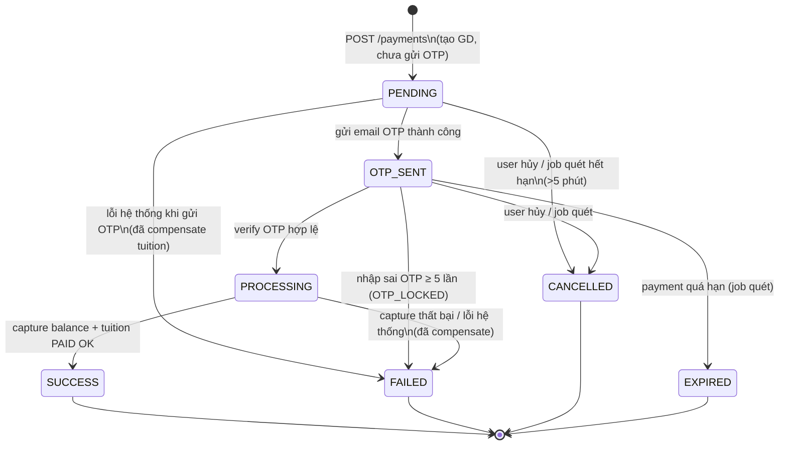

# Tài liệu 06 — FSM Giao dịch & Xử lý Concurrency

> Đáp ứng yêu cầu đề bài mục 6 (transaction & concurrency) + phần FSM trong file làm rõ yêu cầu. Đây là tài liệu căn bản để code payment-service, payer-service, tuition-service.

## 1. State machine của Payment (chuẩn hóa)



### 1.1 Bảng chuyển trạng thái hợp lệ

| Từ \ Đến | PENDING | OTP_SENT | PROCESSING | SUCCESS | FAILED | CANCELLED | EXPIRED |
|---|:--:|:--:|:--:|:--:|:--:|:--:|:--:|
| PENDING | – | ✓ | – | – | ✓ | ✓ | ✓ |
| OTP_SENT | – | – | ✓ | – | ✓ | ✓ | ✓ |
| PROCESSING | – | – | – | ✓ | ✓ | – | – |
| SUCCESS/FAILED/CANCELLED/EXPIRED | – | – | – | – | – | – | – (terminal) |

- Mọi transition không nằm trong bảng → từ chối với `409 STATE_CONFLICT`.
- Bắt buộc ghi **payment_history** (from_status → to_status + note) mỗi lần đổi trạng thái.
- Thi hành 2 lớp: (1) code orchestrator, (2) `CHECK` constraint status + `rowversion` trong SQL Server.

### 1.2 Các trường hợp của trạng thái PENDING (yêu cầu đặc biệt từ file làm rõ)

| Thời điểm | Tình huống | Xử lý |
|---|---|---|
| **Trước khi gửi OTP** | Lock tuition thành công nhưng otp-service lỗi | release tuition → FAILED |
| | Lock tuition thất bại (409) | không tạo payment / CANCELLED |
| | Notification (email OTP) lỗi | release tuition, invalidate OTP → FAILED |
| | User hủy ngay khi đang PENDING | invalidate OTP (nếu đã sinh), release tuition → CANCELLED |
| **Sau khi gửi OTP (OTP_SENT)** | OTP hết hạn 5 phút | OTP → EXPIRED; payment vẫn OTP_SENT nếu payment chưa quá hạn, cho phép resend cùng payment |
| | Nhập sai OTP nhiều lần (đến 5) | FAILED + release tuition |
| | Resend OTP | invalidate OTP cũ → sinh OTP mới (payment vẫn OTP_SENT) |
| | User không thao tác đến `payment.expires_at` | job quét: EXPIRED + release tuition; release balance chỉ nếu đã capture |

**Nguyên tắc xuyên suốt:** mọi trạng thái trung gian (PENDING/OTP_SENT/PROCESSING) đều có **đường ra tài nguyên** — tuition phải về `UNPAID`, OTP phải vô hiệu, khi giao dịch không đi đến SUCCESS.

Lưu ý: OTP hết hạn là trạng thái của **bản ghi OTP**, không phải ngay lập tức là trạng thái
`EXPIRED` của payment. Payment chỉ chuyển `EXPIRED` khi `payment.expires_at` hết hạn hoặc job
phát hiện giao dịch không còn khả năng tiếp tục.

## 2. Cơ chế khóa & transaction trong từng service

### 2.1 payer-service — chống dư âm (Case A)

```python
# capture_balance (payer-service)
with conn.begin() as tx:                      # SQL Server transaction
    row = conn.execute(text("""
        UPDATE accounts
        SET    available_balance = available_balance - :amount
        WHERE  payer_uid = :uid AND available_balance >= :amount
    """), {...})
    if row.rowcount == 0:
        tx.rollback()
        raise InsufficientBalance(...)
    # idempotency: ghi ledger; UNIQUE(payment_id, change_type) chống trừ 2 lần
    conn.execute(text("INSERT INTO balance_ledger (...) VALUES (...)"), {...})
    # commit tự động khi ra khỏi with
```

- **Điểm mấu chốt:** không `SELECT` rồi mới `UPDATE` — chỉ 1 câu UPDATE có điều kiện `balance >= amount`, SQL Server tự khóa row.
- SQL Server mặc định READ COMMITTED + row lock của UPDATE; nếu cần tường minh: `SELECT ... WITH (UPDLOCK, ROWLOCK)` trước.
- `CHECK (available_balance >= 0)` = lưới an toàn thứ 2.

### 2.2 tuition-service — chống double-pay (Case B)

```python
# lock_tuition (tuition-service)
row = conn.execute(text("""
    UPDATE tuitions
    SET    status = 'PAYING'
    WHERE  tuition_id = :tid AND status = 'UNPAID'
"""), {...})
if row.rowcount == 0:
    raise TuitionConflict(...)     # đã PAYING/PAID -> từ chối
```

- **Điểm mấu chốt:** "ai UPDATE được 0 dòng là thua" — conditional update là phép thử-đặt khóa nguyên tử.
- `paid`: `WHERE status='PAYING'` và ghi `paid_by_payment_id`; `release`: `WHERE status='PAYING' AND (paid_by_payment_id IS NULL OR paid_by_payment_id = :payment_id)`.
- **Tầng DB cuối:** `ux_payments_success` trong PaymentDB (filtered unique `tuition_id WHERE status='SUCCESS'`) — kể cả khi logic sai sót, SQL Server cũng chặn 2 bản ghi SUCCESS cho cùng tuition.

### 2.3 payment-service — điều phối tuần tự + idempotency

- Tạo payment: dựa vào filtered unique index `ux_payments_active(uid) WHERE status IN (PENDING, OTP_SENT, PROCESSING)` — vi phạm → bắt lỗi → 409 `PAYMENT_ALREADY_ACTIVE`.
- Idempotency-key: retry `POST /payments` cùng key trả về payment đã tạo (không tạo mới).
- Verify OTP: `UPDATE otps SET status='USED' WHERE otp_id=@id AND status='ACTIVE' AND expires_at > SYSUTCDATETIME()` — chỉ 1 request verify thành công (OTP 1 lần).

### 2.4 Chiến lược bù trừ khi thất bại giữa chừng (Saga đơn giản)

```
1. lock tuition         ──► 2. sinh OTP ──► 3. send OTP email ──► 4. verify OTP
                                                                    │
5. capture balance ──► 6. tuition paid ──► 7. payment SUCCESS      ▼
                                                                9. FAILED path:
Bù trừ tương ứng từng bước đã thực hiện:                          release tuition (+ release
  - đã lock tuition         → release tuition                      balance nếu đã capture)
    - đã sinh OTP             → cập nhật OTP thành `CANCELLED`         + ghi failure_reason
  - đã capture balance      → release balance (ledger RELEASE)
```

- Không dùng distributed transaction (2PC) — lý do: độ trễ + phức tạp vượt yêu cầu đồ án; Saga + job quét đủ đảm bảo **eventual consistency**.
- Job quét (5–10s) là "lưới an toàn" đối chiếu: payment nào kẹt trạng thái trung gian quá hạn sẽ được dọn.

## 3. Job quét hết hạn (payment-sweep)

| Thuộc tính | Giá trị |
|---|---|
| Tần suất | 5–10 giây/lần (config `PAYMENT_SWEEP_INTERVAL`) |
| Nơi chạy | Background task (thread) trong payment-service, khởi động cùng app |
| Bước 1 | `UPDATE otps SET status='EXPIRED' WHERE status='ACTIVE' AND expires_at < now` (otp-service DB) |
| Bước 2 | Lấy payments `status IN (PENDING, OTP_SENT, PROCESSING)` có `expires_at < now` |
| Bước 3 | Với mỗi payment quá hạn: cập nhật OTP thành `EXPIRED`/`CANCELLED` → release tuition theo đúng `payment_id` → release balance chỉ khi có CAPTURE → payment `EXPIRED` → ghi history |
| An toàn | Không release tuition nếu tuition đã `PAID` bởi payment khác; không gọi release balance nếu chưa có CAPTURE; không đụng payment terminal |

## 4. Kịch bản kiểm thử concurrency (bắt buộc demo)

### Kịch bản 1 — Case A (chống dư âm)
1. Chuẩn bị: tài khoản balance 10.000.000; 2 khoản tuition UNPAID 7.000.000 và 5.000.000 (khác học kỳ).
2. Tạo 2 payment đồng thời (2 tab browser hoặc script song song, idempotency keys khác nhau).
3. Kỳ vọng: 1 payment SUCCESS (cái đầu tiên), payment còn lại FAILED/CANCELLED với lý do thiếu dư; **balance cuối = 10.000.000 - khoản thành công ≥ 0**; ledger đúng.

### Kịch bản 2 — Case B (chống double-pay)
1. Chuẩn bị: 1 tuition UNPAID; 2 yêu cầu thanh toán đồng thời (kích hoạt bằng cách gọi nội bộ / 2 phiên với cùng tuition). *(Trong hệ thống self-payment, dựng kịch bản này bằng công cụ test gọi internal API để chứng minh cơ chế.)*
2. Kỳ vọng: **đúng 1** payment SUCCESS; tuition chỉ PAID 1 lần; payment còn lại `PAYMENT_CONFLICT_CONCURRENT`.

### Kịch bản 3 — OTP
1. OTP hết hạn 5 phút → verify trả `OTP_EXPIRED`, OTP giữ `EXPIRED`; resend tạo OTP mới cùng payment nếu payment chưa quá hạn. Payment chỉ `EXPIRED` khi `payment.expires_at` qua.
2. Nhập sai 5 lần → `OTP_LOCKED`, payment FAILED.
3. OTP dùng 1 lần: verify thành công rồi verify lại → `OTP_USED`.

### Kịch bản 4 — Chỉ 1 giao dịch đang chờ
1. User tạo payment (OTP_SENT) rồi cố tạo thêm payment cho cùng tài khoản, kể cả chọn tuition khác → `409 PAYMENT_ALREADY_ACTIVE` (unique index `ux_payments_active`).
2. User hủy giao dịch đang chờ → tạo lại được bình thường.

## 5. Ma trận trạng thái cuối sau mọi sự kiện

| Sự kiện | payment | tuition | balance | OTP | Email |
|---|---|---|---|---|---|
| Thanh toán thành công | SUCCESS | PAID | đã trừ | USED | OTP + confirm(SV, trường) |
| Thiếu dư lúc tạo GD | (không tạo) | UNPAID | nguyên | – | – |
| User hủy | CANCELLED | UNPAID | nguyên | CANCELLED | – |
| OTP hết hạn | OTP_SENT | PAYING | nguyên | EXPIRED | có thể resend |
| Payment hết hạn | EXPIRED | UNPAID | nguyên hoặc release nếu đã capture | EXPIRED/CANCELLED | – |
| Sai OTP 5 lần | FAILED | UNPAID | nguyên | LOCKED | – |
| Lỗi gửi mail OTP | FAILED | UNPAID | nguyên | CANCELLED | – (retry outbox) |
| Lỗi capture (thiếu dư lúc xử lý) | FAILED | UNPAID | nguyên | USED | – |
| Ứng dụng crash giữa chừng | job quét → EXPIRED/FAILED | UNPAID (job release) | chỉ trừ nếu đã capture (ledger khớp) | terminal | outbox tự retry |

> Cột OTP là trạng thái cuối của bản ghi trong OTPDB. Chỉ tác vụ dọn dữ liệu riêng mới xóa bản ghi.

**Bất biến toàn hệ thống sau mọi trường hợp:**
- `SUM(ledger CAPTURE) - SUM(ledger RELEASE)` của 1 account == số dư hiện tại.
- Một tuition_id có tối đa 1 payment SUCCESS (DB đảm bảo).
- payment SUCCESS ⇔ tuition PAID ⇔ đúng 1 CAPTURE trong ledger cùng payment_id.